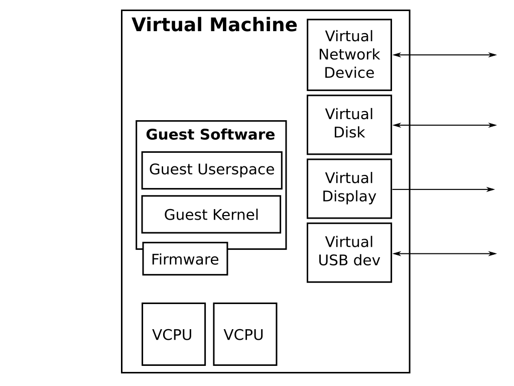
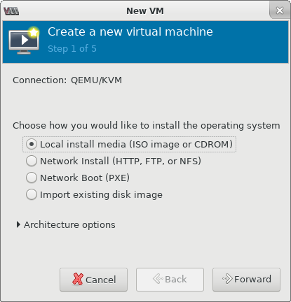
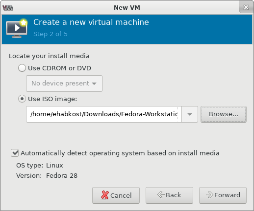
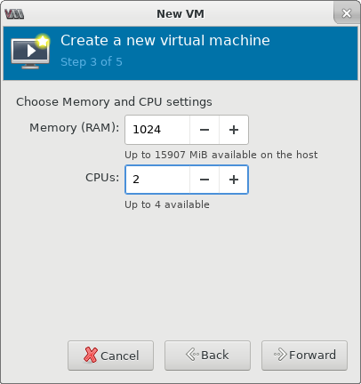
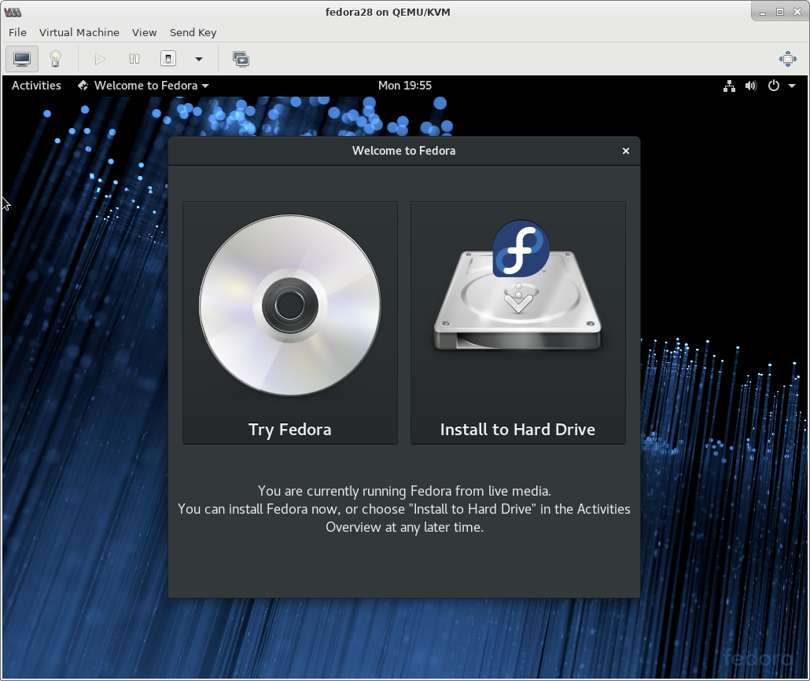
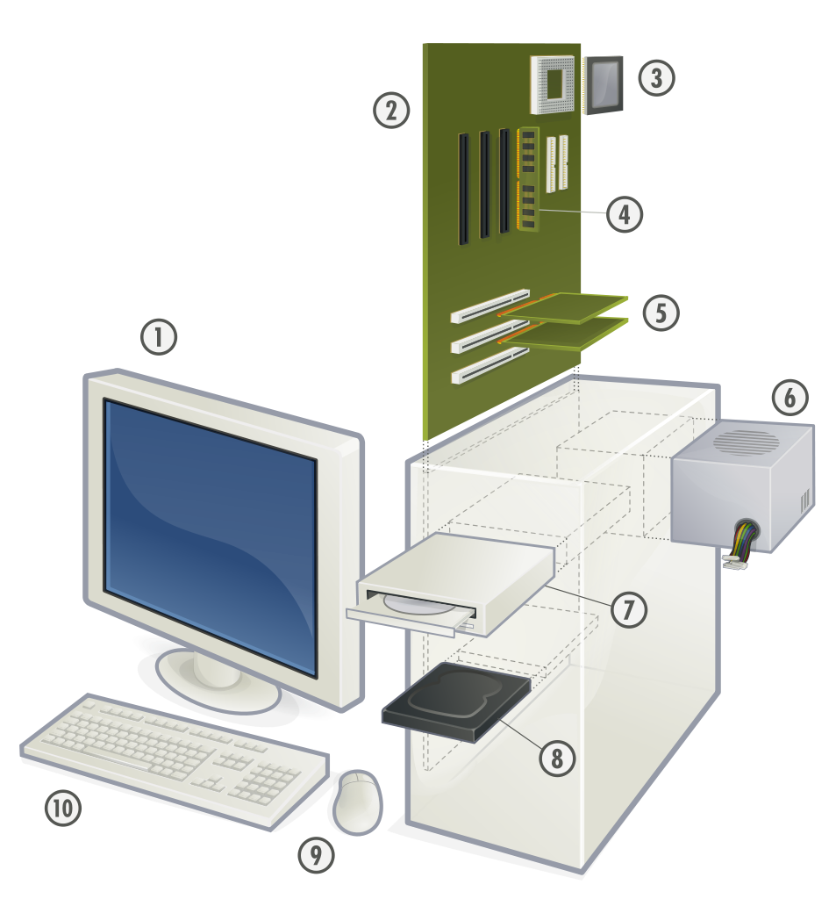
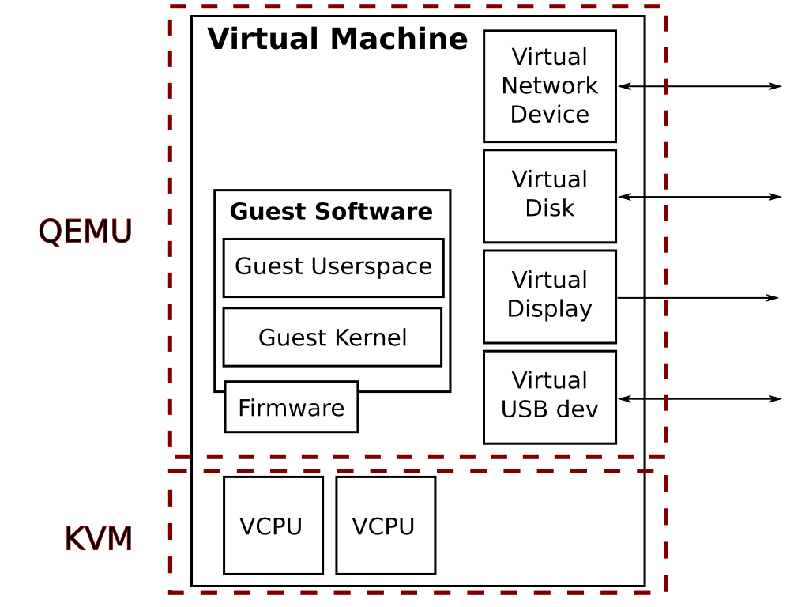
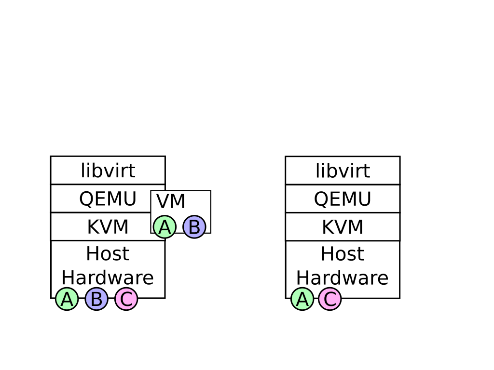
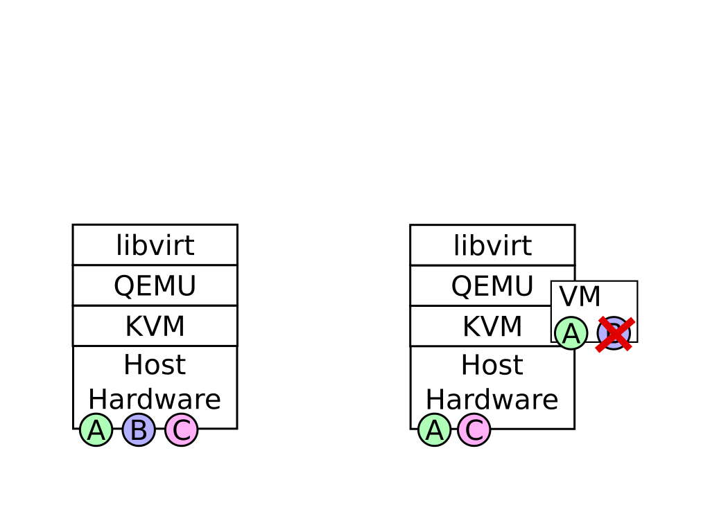
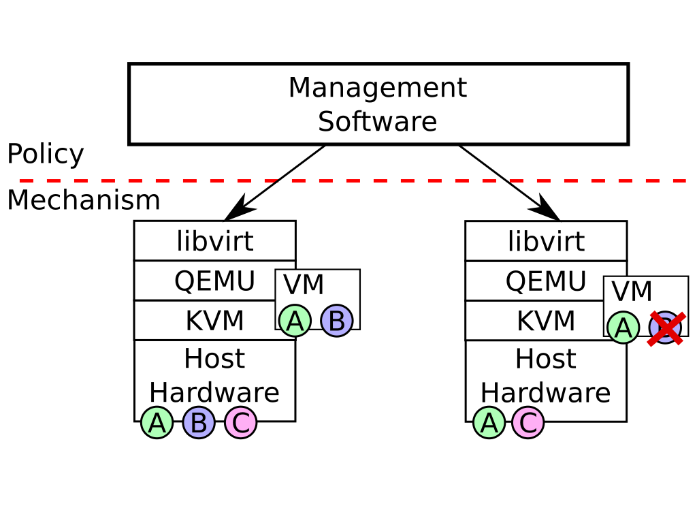

# Building a Virtual CPU from the Ground Up
## KVM and the layers above it
Eduardo Habkost &lt;ehabkost@redhat.com&gt; 
 
<a href="https://linuxdev-br.net/">linuxdev-br 2018</a>

Note:
TODO:
* Glossário

Details to mention:
* CPUID and live-migration
* CPU model updates (+ versioned CPU models)
* Defaults + libosinfo
* Backwards compatibility + inability to change defaults

## Contents

* Introduction (quick dive in)
* Emulating a virtual machine (slow ascent)

Note: Nessa palestra eu vou tentar não focar em um componente
específico do sistema de virtualização, mas em todas as camadas
envolvidas. Vou começar com uma introdução rápida, mergulhando e
explicando rapidamente os componentes envolvidos. Depois da
introdução vou detalhar melhor como algumas operações funcionam.

# Introduction

## A virtual machine

Note: Esse diagrama exemplifica algumas das partes de uma máquina
virtual.  Uma máquina virtual permite rodar outros sistemas
operacionais num computador host, de forma controlada e isolada
do resto do hardware real. Você tem as CPUs virtuais (ou VCPUs),
dispositivos virtuais variados. O software que roda dentro da
máquina virtual é chamado de "guest". O hardware real e o sistema
operacional que rodam no hardware real é o **host**.

## The Layers

<!-- credit: https://www.flickr.com/photos/theilr/4947839133 -->

Note: Vamos começar então a descascar as camadas em torno de um
sistema de virtualização.

## First layer: the user interface

<table class="layers">
<tr class="current"><td>management app</td></tr>
<tr class="hidden"><td>libvirt</td></tr>
<tr class="hidden"><td>QEMU</td></tr>
<tr class="hidden"><td>KVM (kernel)</td></tr>
<tr class="hidden"><td>Hardware (CPU)</td></tr>
</table>

Note: A primeira camada é a interface com o usuário.  Existem
inúmeros sistemas de gerenciamento de máquinas virtuais.  No meu
exemplo, vou mostrar o virt-manager, porque é muito simples de rodar
no desktop.

### Creating a VM

Note: Essa é a interface para criar uma nova VM no virt-manager.
Primeiro ele pergunta como você vai instalar o sistema; se é com
boot pela rede, imagem ISO, e outras opções. Eu escolhi instalar
a partir de uma imagem ISO.

### Install location

Note: Depois ele pergunta onde está a mídia de instalação.
Selecionei uma imagem ISO do Fedora que eu baixei.

### CPU & RAM

Note: Ele te pergunta quanto de memória e quantas CPUs a máquina
virtual vai ter.

### Storage

Note:
Quanto espaço em disco.

### A Running Virtual Machine

Note: E depois disso a sua VM está rodando. No caso eu tenho uma
tela do virt-manager mostrando o desktop Gnome e opções de
instalação do Fedora.

<!-- ## Next layer:  -->
<!--   -->
<!-- <table class="layers">  -->
<!-- <tr><td>management app</td></tr>  -->
<!-- <tr class="current"><td>virtinst</td></tr>  -->
<!-- </table>  -->
<!--   -->
<!--   -->
<!-- ## virtinst interface  -->
<!--   -->
<!-- <pre><code>  -->
<!-- # virt-install                              \  -->
<!-- > --name fedora28                           \  -->
<!-- > --location ~ehabkost/Downloads/fedora.iso \  -->
<!-- > --vcpus 2                                 \  -->
<!-- > --ram 1024                                \  -->
<!-- > --disk format=qcow2,path=/var/lib/libvirt/images/fedora28.qcow2,size=8  -->
<!--   -->
<!-- </code></pre>  -->
<!--   -->
<!-- Note:  -->
<!--   -->
<!-- virtinst is a Python module used by virt-manager, and  -->
<!-- virt-install is a command-line interface that exposes the same  -->
<!-- functionality.  The command-line shown here is equivalent to the  -->
<!-- options I have chosen on virt-manager: it specifies the install  -->
<!-- media location, CPU, RAM and storage resources, and the VM will  -->
<!-- be created.  -->
<!--  -->
<!--  -->
## Next layer:

<table class="layers">
<tr><td>management app</td></tr>
<tr class="current"><td>libvirt</td></tr>
<tr class="hidden"><td>QEMU</td></tr>
<tr class="hidden"><td>KVM (kernel)</td></tr>
<tr class="hidden"><td>Hardware (CPU)</td></tr>
</table>

Note: A próxima camada nessa pilha é a biblioteca que o
virt-manager utiliza para gerenciar as VMs, que é a libvirt.

## libvirt interface (XML)

<pre style="font-size: 0.25em"><code data-trim class="xml">
<domain type="kvm">
  <name>fedora28</name>
  <uuid>34e74d0e-2de0-4c0d-b6f7-4ad1ac1262b7</uuid>
  <memory>1048576</memory>
  <currentMemory>1048576</currentMemory>
  <vcpu>2</vcpu>
  <os>
    <type arch="x86_64">hvm</type>
    <kernel>/var/lib/libvirt/boot/virtinst-vmlinuz.SqGhHd</kernel>
    <initrd>/var/lib/libvirt/boot/virtinst-initrd.img.Ix7vKA</initrd>
  </os>
  <features>
    <acpi/>
    <apic/>
    <vmport state="off"/>
  </features>
  <cpu mode="custom" match="exact">
    <model>Skylake-Client</model>
  </cpu>
  <clock offset="utc">
    <timer name="rtc" tickpolicy="catchup"/>
    <timer name="pit" tickpolicy="delay"/>
    <timer name="hpet" present="no"/>
  </clock>
  <on_reboot>destroy</on_reboot>
  <pm>
    <suspend-to-mem enabled="no"/>
    <suspend-to-disk enabled="no"/>
  </pm>
  <devices>
    <emulator>/usr/bin/qemu-kvm</emulator>
    <disk type="file" device="disk">
      <driver name="qemu" type="qcow2"/>
      <source file="/var/lib/libvirt/images/fedora28.qcow2"/>
      <target dev="vda" bus="virtio"/>
    </disk>
    <disk type="file" device="cdrom">
      <driver name="qemu" type="raw"/>
      <source file="/home/ehabkost/Downloads/Fedora-Workstation-Live-x86_64-28-1.1.iso"/>
      <target dev="hda" bus="ide"/>
      <readonly/>
    </disk>
    <controller type="usb" index="0" model="ich9-ehci1"/>
    <controller type="usb" index="0" model="ich9-uhci1">
      <master startport="0"/>
    </controller>
    <controller type="usb" index="0" model="ich9-uhci2">
      <master startport="2"/>
    </controller>
    <controller type="usb" index="0" model="ich9-uhci3">
      <master startport="4"/>
    </controller>
    <interface type="network">
      <source network="default"/>
      <mac address="52:54:00:22:19:06"/>
      <model type="virtio"/>
    </interface>
    <input type="tablet" bus="usb"/>
    <graphics type="spice" port="-1" tlsPort="-1" autoport="yes">
      <image compression="off"/>
    </graphics>
    <console type="pty"/>
    <channel type="unix">
      <source mode="bind"/>
      <target type="virtio" name="org.qemu.guest_agent.0"/>
    </channel>
    <channel type="spicevmc">
      <target type="virtio" name="com.redhat.spice.0"/>
    </channel>
    <sound model="ich6"/>
    <video>
      <model type="qxl"/>
    </video>
    <redirdev bus="usb" type="spicevmc"/>
    <redirdev bus="usb" type="spicevmc"/>
    <rng model="virtio">
      <backend model="random">/dev/urandom</backend>
    </rng>
  </devices>
</domain>
<domain type="kvm">
  <name>fedora28</name>
  <uuid>34e74d0e-2de0-4c0d-b6f7-4ad1ac1262b7</uuid>
  <memory>1048576</memory>
  <currentMemory>1048576</currentMemory>
  <vcpu>2</vcpu>
  <os>
    <type arch="x86_64">hvm</type>
    <boot dev="hd"/>
  </os>
  <features>
    <acpi/>
    <apic/>
    <vmport state="off"/>
  </features>
  <cpu mode="custom" match="exact">
    <model>Skylake-Client</model>
  </cpu>
  <clock offset="utc">
    <timer name="rtc" tickpolicy="catchup"/>
    <timer name="pit" tickpolicy="delay"/>
    <timer name="hpet" present="no"/>
  </clock>
  <pm>
    <suspend-to-mem enabled="no"/>
    <suspend-to-disk enabled="no"/>
  </pm>
  <devices>
    <emulator>/usr/bin/qemu-kvm</emulator>
    <disk type="file" device="disk">
      <driver name="qemu" type="qcow2"/>
      <source file="/var/lib/libvirt/images/fedora28.qcow2"/>
      <target dev="vda" bus="virtio"/>
    </disk>
    <disk type="file" device="cdrom">
      <target dev="hda" bus="ide"/>
      <readonly/>
    </disk>
    <controller type="usb" index="0" model="ich9-ehci1"/>
    <controller type="usb" index="0" model="ich9-uhci1">
      <master startport="0"/>
    </controller>
    <controller type="usb" index="0" model="ich9-uhci2">
      <master startport="2"/>
    </controller>
    <controller type="usb" index="0" model="ich9-uhci3">
      <master startport="4"/>
    </controller>
    <interface type="network">
      <source network="default"/>
      <mac address="52:54:00:22:19:06"/>
      <model type="virtio"/>
    </interface>
    <input type="tablet" bus="usb"/>
    <graphics type="spice" port="-1" tlsPort="-1" autoport="yes">
      <image compression="off"/>
    </graphics>
    <console type="pty"/>
    <channel type="unix">
      <source mode="bind"/>
      <target type="virtio" name="org.qemu.guest_agent.0"/>
    </channel>
    <channel type="spicevmc">
      <target type="virtio" name="com.redhat.spice.0"/>
    </channel>
    <sound model="ich6"/>
    <video>
      <model type="qxl"/>
    </video>
    <redirdev bus="usb" type="spicevmc"/>
    <redirdev bus="usb" type="spicevmc"/>
    <rng model="virtio">
      <backend model="random">/dev/urandom</backend>
    </rng>
  </devices>
</domain>
</code></pre>

Note: A libvirt é uma biblioteca com bindings para várias
linguagens, e na libvirt a configuração de uma máquina virtual é
representada no formato XML. Vocês não vão conseguir ler, mas no
slide está o arquivo XML gerado pelo virt-manager para rodar
a máquina virtual.

## Next layer:

<table class="layers">
<tr><td>management app</td></tr>
<tr><td>libvirt</td></tr>
<tr class="current"><td>QEMU</td></tr>
<tr class="hidden"><td>KVM (kernel)</td></tr>
<tr class="hidden"><td>Hardware (CPU)</td></tr>
</table>

Note: a libvirt por sua vez vai executar e controlar o QEMU.

## QEMU interface (command-line)

<pre style="font-size: 0.55em"><code data-trim>
# /usr/bin/qemu-kvm \
> -name guest=fedora28,debug-threads=on \
> -S \
> -object secret,id=masterKey0,format=raw,file=/var/lib/libvirt/qemu/domain-41-fedora28/master-key.aes \
> -machine pc-i440fx-2.10,accel=kvm,usb=off,vmport=off,dump-guest-core=off \
> -cpu Skylake-Client \
> -m 1024 \
> -realtime mlock=off \
> -smp 2,sockets=2,cores=1,threads=1 \
> -uuid f79dd672-248b-4598-9c4a-e1090235f132 \
> -no-user-config \
> -nodefaults \
> -chardev socket,id=charmonitor,path=/var/lib/libvirt/qemu/domain-41-fedora28/monitor.sock,server,nowait \
> -mon chardev=charmonitor,id=monitor,mode=control \
> -rtc base=utc,driftfix=slew \
> -global kvm-pit.lost_tick_policy=delay \
> -no-hpet \
> -no-reboot \
> -global PIIX4_PM.disable_s3=1 \
> -global PIIX4_PM.disable_s4=1 \
> -boot strict=on \
> -kernel /var/lib/libvirt/boot/virtinst-vmlinuz.dPrnLR \
> -initrd /var/lib/libvirt/boot/virtinst-initrd.img.hrYI8n \
> -device ich9-usb-ehci1,id=usb,bus=pci.0,addr=0x5.0x7 \
> -device ich9-usb-uhci1,masterbus=usb.0,firstport=0,bus=pci.0,multifunction=on,addr=0x5 \
> -device ich9-usb-uhci2,masterbus=usb.0,firstport=2,bus=pci.0,addr=0x5.0x1 \
> -device ich9-usb-uhci3,masterbus=usb.0,firstport=4,bus=pci.0,addr=0x5.0x2 \
> -device virtio-serial-pci,id=virtio-serial0,bus=pci.0,addr=0x6 \
> -drive file=/var/lib/libvirt/images/fedora28.qcow2,format=qcow2,if=none,id=drive-virtio-disk0 \
> -device virtio-blk-pci,scsi=off,bus=pci.0,addr=0x7,drive=drive-virtio-disk0,id=virtio-disk0,bootindex=1 \
> -drive file=/home/ehabkost/Downloads/Fedora-Workstation-Live-x86_64-28-1.1.iso,format=raw,if=none,id=drive-ide0-0-0,readonly=on \
> -device ide-cd,bus=ide.0,unit=0,drive=drive-ide0-0-0,id=ide0-0-0 \
> -netdev tap,fd=26,id=hostnet0,vhost=on,vhostfd=28 \
> -device virtio-net-pci,netdev=hostnet0,id=net0,mac=52:54:00:ee:2f:dd,bus=pci.0,addr=0x3 \
> -chardev pty,id=charserial0 \
> -device isa-serial,chardev=charserial0,id=serial0 \
> -chardev socket,id=charchannel0,path=/var/lib/libvirt/qemu/channel/target/domain-41-fedora28/org.qemu.guest_agent.0,server,nowait \
> -device virtserialport,bus=virtio-serial0.0,nr=1,chardev=charchannel0,id=channel0,name=org.qemu.guest_agent.0 \
> -chardev spicevmc,id=charchannel1,name=vdagent \
> -device virtserialport,bus=virtio-serial0.0,nr=2,chardev=charchannel1,id=channel1,name=com.redhat.spice.0 \
> -device usb-tablet,id=input0,bus=usb.0,port=1 \
> -spice port=5900,addr=127.0.0.1,disable-ticketing,image-compression=off,seamless-migration=on \
> -device qxl-vga,id=video0,ram_size=67108864,vram_size=67108864,vram64_size_mb=0,vgamem_mb=16,max_outputs=1,bus=pci.0,addr=0x2 \
> -device intel-hda,id=sound0,bus=pci.0,addr=0x4 \
> -device hda-duplex,id=sound0-codec0,bus=sound0.0,cad=0 \
> -chardev spicevmc,id=charredir0,name=usbredir \
> -device usb-redir,chardev=charredir0,id=redir0,bus=usb.0,port=2 \
> -chardev spicevmc,id=charredir1,name=usbredir \
> -device usb-redir,chardev=charredir1,id=redir1,bus=usb.0,port=3 \
> -device virtio-balloon-pci,id=balloon0,bus=pci.0,addr=0x8 \
> -object rng-random,id=objrng0,filename=/dev/urandom \
> -device virtio-rng-pci,rng=objrng0,id=rng0,bus=pci.0,addr=0x9 \
> -msg timestamp=on
</code></pre>

Note: O QEMU é uma ferramenta de linha de comando. No slide a
gente tem a linha de comando gerada pela libvirt para a VM que
mostrei no virt-manager.

## QEMU interface (QMP)

<pre><code data-trim class="lang-js">
⇒ { "execute": "device_add",
     "arguments": { "mac": "01:02:03:04:05:06",
                    "driver": "e1000" } }
⇐ { "return": {} }
⇒ { "execute": "query-cpus",
     "arguments": {} }
⇐ { "return": [{ "halted": false, "pc": 133130950,
                  "current": true,
                  "qom_path": "/machine/unattached/device[0]",
                  "thread_id": 22230, "arch": "x86",
                  "CPU": 0 } ] }
⇒ { "execute": "query-kvm",
     "arguments": {} }
⇐ { "return": { "enabled": true, "present": true } }
</code></pre>

Note: o QEMU também tem um protocolo de comunicação com outros
processos em runtime chamado QMP (QEMU Monitor Protocol). Eu nao
vou entrar em detalhes sobre ele, mas é interessante saber que
ele existe.

## Next layer:

<table class="layers">
<tr><td>management app</td></tr>
<tr><td>libvirt</td></tr>
<tr><td>QEMU (userspace)</td></tr>
<tr class="current"><td>KVM (kernel)</td></tr>
<tr class="hidden"><td>Hardware (CPU)</td></tr>
</table>

Note: o QEMU é o componente de userspace de mais baixo nível
nessa pilha, e ele se comunica com o módulo KVM do kernel.

## KVM interface

<pre><code class="c" data-trim>
fd = open("/dev/kvm", ...);
vmfd = ioctl(kvm, KVM_CREATE_VM, ...);
vcpufd = ioctl(vmfd, KVM_CREATE_VCPU, ...);
while (1) {
    ioctl(vcpufd, KVM_RUN, ...);
}
</code></pre>

Note: O KVM é controlado principalmente através de um arquivo de
dispotivo, o /dev/kvm, e de uma série de chamadas `ioctl` para
criação, configuração e execução de VCPUs. O código no slide é só
uma simplificação de como o processo ocorre. O QEMU abre o
/dev/kvm, pede para criar um file descriptor para a VM, cria um
file descriptor para cada VCPU, e chama uma `ioctl` específica
para finalmente rodar o código do guest nessa VCPU.

## Next layer:

<table class="layers">
<tr><td>management app</td></tr>
<tr><td>libvirt</td></tr>
<tr><td>QEMU (userspace)</td></tr>
<tr><td>KVM (kernel)</td></tr>
<tr class="current"><td>Hardware (CPU)</td></tr>
</table>

Note: O KVM, no final, é quem vai se comunicar com o hardware e
utilizar as funcionalidades de virtualização da CPU física.

## Hardware (CPU) interfaces (x86)

<table>
<tr><td></td><td><b>VMX</b> (Intel)                                </td><td><b>SVM</b> (AMD)                        </td></tr>
<tr><td>Setup</td><td>Virtal Machine Control Structure (**VMCS**)  </td><td>Virtal Machine Control Block (**VMCB**) </td></tr>
<tr><td>Launch</td><td>**`VMLAUNCH`**                              </td><td>**`VMRUN`**                             </td></tr>
<tr><td>Resume</td><td>**`VMRESUME`**                              </td><td>**`VMRUN`**                             </td></tr>
</table>

Others: arm, arm64, mips, powerpc, s390.

Note: na plataforma x86 existem duas interfaces de virtualização
por hardware, mas elas são muito parecidas. Nas CPUs Intel a
tecnologia se chama VMX, e nas CPUs AMD se chama SVM. As duas
basicamente oferecem mecanismos para configurar o estado de uma
CPU virtual numa área de memória, e instruções para rodar código
no contexto de uma CPU virtual.

## The Layers

<table class="layers">
<tr class="visible"><td>management app</td></tr>
<tr class="visible"><td>libvirt</td></tr>
<tr class="visible"><td>QEMU (userspace)</td></tr>
<tr class="visible"><td>KVM (kernel)</td></tr>
<tr class="visible"><td>Hardware (CPU)</td></tr>
</table>

Note: **00:05:00** Finalizando, essas são as camadas sobre as quais eu vou
falar: a aplicação de gerenciamento, a libvirt, o QEMU, o KVM, e
o hardware.

## The virtual hardware

(a gross oversimplification)

<h3>QEMU</h3>

<!-- credit: https://pt.m.wikipedia.org/wiki/Ficheiro:Personal_computer,_exploded.svg -->

<h3>KVM</h3>

<!-- credit: https://pixabay.com/pt/cpu-processador-macro-caneta-pin-564771/ -->

Note: uma simplificação muito grosseira do sistema é que o KVM e
o hardware só cuidam de virtualizar a CPU, e o QEMU cuida de
virtualizar todo o resto (rede, disco, teclado, mouse, monitor).
Na prática existem uma série de otimizações que acabam tornando
essa divisão um pouco mais complexa.

<!-- ## The virtual hardware -->
<!--  -->
<!--  -->
<!--  -->
<!-- Note: retornando àquele diagrama do início, uma simplificação -->
<!-- muito grosseira do sistema é que o KVM e o hardware só cuidam de -->
<!-- virtualizar a CPU, e o QEMU cuida de virtualizar todo o resto. -->
<!-- Mas reforçando, isso é só uma simplificação, porque na prática -->
<!-- existem uma série de otimizações que acabam tornando essa divisão -->
<!-- um pouco mais complexa. -->
<!--  -->
<!--  -->
<!-- ## Virtual hardware configuration -->
<!--  -->
<!-- <pre style="font-size: 0.55em"><code data-trim> -->
<!-- # /usr/bin/qemu-kvm \ -->
<!-- > -name guest=fedora28,debug-threads=on \ -->
<!-- > -S \ -->
<!-- > -object secret,id=masterKey0,format=raw,file=/var/lib/libvirt/qemu/domain-41-fedora28/master-key.aes \ -->
<!-- > -machine pc-i440fx-2.10,accel=kvm,usb=off,vmport=off,dump-guest-core=off \ -->
<!-- > -cpu Skylake-Client \ -->
<!-- > -m 1024 \ -->
<!-- > -realtime mlock=off \ -->
<!-- > -smp 2,sockets=2,cores=1,threads=1 \ -->
<!-- > -uuid f79dd672-248b-4598-9c4a-e1090235f132 \ -->
<!-- > -no-user-config \ -->
<!-- > -nodefaults \ -->
<!-- > -chardev socket,id=charmonitor,path=/var/lib/libvirt/qemu/domain-41-fedora28/monitor.sock,server,nowait \ -->
<!-- > -mon chardev=charmonitor,id=monitor,mode=control \ -->
<!-- > -rtc base=utc,driftfix=slew \ -->
<!-- > -global kvm-pit.lost_tick_policy=delay \ -->
<!-- > -no-hpet \ -->
<!-- > -no-reboot \ -->
<!-- > -global PIIX4_PM.disable_s3=1 \ -->
<!-- > -global PIIX4_PM.disable_s4=1 \ -->
<!-- > -boot strict=on \ -->
<!-- > -kernel /var/lib/libvirt/boot/virtinst-vmlinuz.dPrnLR \ -->
<!-- > -initrd /var/lib/libvirt/boot/virtinst-initrd.img.hrYI8n \ -->
<!-- > -device ich9-usb-ehci1,id=usb,bus=pci.0,addr=0x5.0x7 \ -->
<!-- > -device ich9-usb-uhci1,masterbus=usb.0,firstport=0,bus=pci.0,multifunction=on,addr=0x5 \ -->
<!-- > -device ich9-usb-uhci2,masterbus=usb.0,firstport=2,bus=pci.0,addr=0x5.0x1 \ -->
<!-- > -device ich9-usb-uhci3,masterbus=usb.0,firstport=4,bus=pci.0,addr=0x5.0x2 \ -->
<!-- > -device virtio-serial-pci,id=virtio-serial0,bus=pci.0,addr=0x6 \ -->
<!-- > -drive file=/var/lib/libvirt/images/fedora28.qcow2,format=qcow2,if=none,id=drive-virtio-disk0 \ -->
<!-- > -device virtio-blk-pci,scsi=off,bus=pci.0,addr=0x7,drive=drive-virtio-disk0,id=virtio-disk0,bootindex=1 \ -->
<!-- > -drive file=/home/ehabkost/Downloads/Fedora-Workstation-Live-x86_64-28-1.1.iso,format=raw,if=none,id=drive-ide0-0-0,readonly=on \ -->
<!-- > -device ide-cd,bus=ide.0,unit=0,drive=drive-ide0-0-0,id=ide0-0-0 \ -->
<!-- > -netdev tap,fd=26,id=hostnet0,vhost=on,vhostfd=28 \ -->
<!-- > -device virtio-net-pci,netdev=hostnet0,id=net0,mac=52:54:00:ee:2f:dd,bus=pci.0,addr=0x3 \ -->
<!-- > -chardev pty,id=charserial0 \ -->
<!-- > -device isa-serial,chardev=charserial0,id=serial0 \ -->
<!-- > -chardev socket,id=charchannel0,path=/var/lib/libvirt/qemu/channel/target/domain-41-fedora28/org.qemu.guest_agent.0,server,nowait \ -->
<!-- > -device virtserialport,bus=virtio-serial0.0,nr=1,chardev=charchannel0,id=channel0,name=org.qemu.guest_agent.0 \ -->
<!-- > -chardev spicevmc,id=charchannel1,name=vdagent \ -->
<!-- > -device virtserialport,bus=virtio-serial0.0,nr=2,chardev=charchannel1,id=channel1,name=com.redhat.spice.0 \ -->
<!-- > -device usb-tablet,id=input0,bus=usb.0,port=1 \ -->
<!-- > -spice port=5900,addr=127.0.0.1,disable-ticketing,image-compression=off,seamless-migration=on \ -->
<!-- > -device qxl-vga,id=video0,ram_size=67108864,vram_size=67108864,vram64_size_mb=0,vgamem_mb=16,max_outputs=1,bus=pci.0,addr=0x2 \ -->
<!-- > -device intel-hda,id=sound0,bus=pci.0,addr=0x4 \ -->
<!-- > -device hda-duplex,id=sound0-codec0,bus=sound0.0,cad=0 \ -->
<!-- > -chardev spicevmc,id=charredir0,name=usbredir \ -->
<!-- > -device usb-redir,chardev=charredir0,id=redir0,bus=usb.0,port=2 \ -->
<!-- > -chardev spicevmc,id=charredir1,name=usbredir \ -->
<!-- > -device usb-redir,chardev=charredir1,id=redir1,bus=usb.0,port=3 \ -->
<!-- > -device virtio-balloon-pci,id=balloon0,bus=pci.0,addr=0x8 \ -->
<!-- > -object rng-random,id=objrng0,filename=/dev/urandom \ -->
<!-- > -device virtio-rng-pci,rng=objrng0,id=rng0,bus=pci.0,addr=0x9 \ -->
<!-- > -msg timestamp=on -->
<!-- </code></pre> -->
<!--  -->
<!-- Note: -->
<!--  -->
<!--  -->
# From guest code to device emulation

One example

## Terminology

* Inside the VM:
  * **GVA**: Guest Virtual Address
  * **GPA**: Guest Physical Address
  * Guest page tables map GVAs to GPAs
* In the host:
  * **HVA**: Host Virtual Address
  * **HPA**: Host Physical Address

Note: antes de falar de alguns detalhes eu preciso explicar um
pouco de terminologia.  Num sistema em hardware físico você
normalmente tem dois tipos de endereços de memória: endereços
virtuais e endereços físicos. Quando a gente tem virtualização
envolvida, isso se duplica: dentro do guest você possui os
endereços virtuais e físicos do guest, e no lado do host você tem
os endereços virtuais e reais dentro do host.

## 1. Launch guest code

1. Userspace allocates memory for guest (HVA)
2. `ioctl(KVM_SET_USER_MEMORY_REGION, ...)`
   * Input: GPA → HVA mapping
  * GPA → HPA mapping is built
3. `ioctl(vcpufd, KVM_RUN, ...);`
  *  `VMLAUNCH`/`VMRESUME` (VMX) or `VMRUN` (AMD)

Note: Os passos básicos para se rodar código em uma VCPU são os
seguintes: primeiro o código em userspace precisa alocar memória
para a máquina virtual.  Em seguida as áreas de memória, que são
endereços virtuais do lado do host, são registradas com o KVM,
associadas com endereços físicos do guest.  Depois disso, o QEMU
pode pedir para o KVM rodar o código da CPU usando usando outra
`ioctl`.  Já dentro do kernel, o KVM vai inicializar as
estruturas necessárias para o hardware, e vai iniciar a execução
do código do guest.

## 2. Physical CPU runs guest code

...until it stops:

<pre class="fragment"><code class="c" data-noescape>  <mark>outw</mark>(val, uhci->io_addr + reg);</code></pre>

Note: O hardware físico vai executar as instruções da máquina
virtual.  Até chegar em alguma operação que o hardware não pode
cuidar sozinho.

Por exemplo, quando o guest tenta interagir com o hardware.  Vou
usar como exemplo uma instrução de I/O feita por um driver no
guest.

## 3. VM Exits

<table class="layers" class="fragment" data-fragment-index="1">
<tr><td>management app</td></tr>
<tr><td>libvirt</td></tr>
<tr><td>QEMU (userspace)</td></tr>
<tr class="current"><td>KVM (kernel)</td><td class="fragment" data-fragment-index="3" style="border: none !important; text-align: left;">— I've got this!</td></tr>
<tr class="visible"><td>Hardware (CPU)</td><td class="fragment" data-fragment-index="2" style="border: none !important; text-align: left;">— Please help! <code>EXIT_REASON_IO_INSTRUCTION</code></td></tr>
</table>

Note: Nesse momento acontece o que chamamos de "VM exit".  Uma
"VM exit" é quando o hardware sai do modo de execução de máquina
virtual e retorna ao sistema host.  O host por sua vez, vai
receber informações sobre a operação que causou a VM Exit.

## 4. Software emulation (KVM)

<pre><code class="c" data-trim>
while (1) {
  vcpu_run(vcpu);        /* Hardware */
  r = handle_exit(vcpu); /* Software emulation */
  if (r)
    break;
}
</code></pre>

Note: Dentro do KVM, o modelo de execução é esse: o KVM solicita
ao hardware que rode o código do guest, e cada vez que houver
um VM exit, ele vai tentar emular a operação por software dentro
do próprio KVM.  Algumas vezes isso é possível, em outras vezes
não.  Se o KVM for capaz de emular a operação, ele retorna o loop
e continua executando código da VM.  Se ele não conseguir...

## 4. Exit to userspace

<table class="layers" class="fragment" data-fragment-index="1">
<tr><td>management app</td></tr>
<tr><td>libvirt</td></tr>
<tr class="current"><td>QEMU (userspace)</td><td class="fragment" data-fragment-index="3" style="border: none !important; text-align: left;">— I've got this!</td></tr>
<tr class="visible"><td>KVM (kernel)</td><td class="fragment" data-fragment-index="2" style="border: none !important; text-align: left;">— Please help! <code>vcpu->run.exit_reason = KVM_EXIT_IO</code></td></tr>
<tr><td>Hardware (CPU)</td></tr>
</table>

Note: o kernel vai pedir ajuda para userspace lidar com a
operação.

## 5. QEMU VCPU loop

<pre><code class="c" data-trim data-noescape>
vcpufd = ioctl(vmfd, KVM_CREATE_VCPU, ...);
struct kvm_run *run = mmap(..., <b>vcpufd</b>, 0);
while (1) {
    ioctl(vcpufd, <mark>KVM_RUN</mark>, ...);
    switch (<mark>run->exit_reason</mark>) {
        <mark>/* handle VM exit */</mark>
    }
}
</code></pre>

Note: O método mais básico--mas não o único--para tratar uma operação da VM em
userspace é simplesmente retornar da `ioctl` `KVM_RUN`, após
preencher algumas informações em uma estrutura de dados.

## 6. QEMU I/O emulation (KVM exit)

<pre><code class="c" data-trim data-noescape>
        switch (run->exit_reason) {
        case KVM_EXIT_IO:
            <mark>kvm_handle_io</mark>(...);
</code></pre>

Note: esse é um pequeno trecho de código dentro do QEMU que lida
com uma VM exit em userspace.  O QEMU tem uma série de abstrações
para modelar operações de I/O.

## 6. QEMU I/O emulation (implementation)

<pre><code class="c" data-trim data-noescape>
static void <mark>uhci_port_write</mark>(...)
{
    UHCIState *s = opaque;

    trace_usb_uhci_mmio_writew(addr, val);

    switch(addr) {
    case 0x00:
        if ((val & UHCI_CMD_RS) && !(s->cmd & UHCI_CMD_RS)) {
            /* start frame processing */
            trace_usb_uhci_schedule_start();
            s->expire_time = qemu_clock_get_ns(QEMU_CLOCK_VIRTUAL) +
                (NANOSECONDS_PER_SECOND / FRAME_TIMER_FREQ);
            timer_mod(s->frame_timer, s->expire_time);
            s->status &= ~UHCI_STS_HCHALTED;
        } else if (!(val & UHCI_CMD_RS)) {
            s->status |= UHCI_STS_HCHALTED;
        }
</code></pre>

Note: no final das contas, essas abstrações vão acabar chamando o
código de emulação de dispositivo.  No slide a gente tem a função
dentro do código de emulação de controladora USB do próprio QEMU,
que trata o evento de I/O.

## Causes of VM Exits (full)

Instructions: CPUID, GETSEC, INVD, XSETBV, INVEPT, INVVPID,
VMCALL, VMCLEAR, VMLAUNCH, VMPTRLD, VMPTRST, VMRESUME, VMXOFF,
and VMXON. Conditionally: CLTS, ENCLS, HLT, IN, OUT, INVLPG,
INVPCID, LGDT, LIDT, LLDT, LTR, SGDT, SIDT, SLDT, STR, LMSW,
MONITOR, MOV from CR3, MOV from CR8, MOV to CR0, MOV to CR3, MOV
to CR4, MOV to CR8, MOV DR, MWAIT, PAUSE, RDMSR, RDPMC, RDRAND,
RDSEED, RDTSC, RDTSCP, RSM, VMREAD, VMWRITE, WBINVD, WRMSR,
XRSTORS, XSAVES. Exceptions, Triple faults, External interrupts,
NMIs, INIT signal, SIPIs, Task switches, SMIs, VMX-preemption
timer

Note: nesse exemplo eu ilustrei apenas uma operação que causou
uma VM exit, mas a lista de eventos é gigante. No slide eu copiei
a lista de possíveis causas para uma VM Exit do manual da Intel.
O KVM precisa ser capaz de tratar todas elas e direcionar o
evento para o componente responsável, seja ele dentro do kernel,
ou em userspace.

## Nobody likes VM Exits

## They are expensive <!-- .element: class="fragment" -->

## All layers (hardware and software) try to minimize them <!-- .element: class="fragment" -->

Note: **00:20:00** ok, nós só temos um problema: ninguém gosta de VM Exits.

Elas são caras, elas demoram muito para ser tratadas.

Então todas as camadas da pilha tentam fazer alguma coisa para
diminuir a frequência com que isso ocorre.

Não vai ser possível entrar em detalhes nessa palestra sobre como
isso é feito, mas isso explica várias das complexidades na
interface entre o KVM e o hardware, e entre o QEMU e o KVM.

## Userspace (QEMU) controls the virtual hardware

<b>All</b> hardware emulation is configured by userspace

Note: Um ponto relevante a se lembrar é o seguinte:
mesmo quando a gente toma determinados atalhos para evitar VM
exits, o KVM e o hardware físico oferecem apenas os mecanismos para
utilizar o hardware, mas quem vai configurar e controlar o
processo todo (inclusive configurar como a própria VCPU vai
funcionar) é o userspace (no caso, o QEMU).

# Guest ABI and VM management

## libvirt/QEMU Guest ABI guarantees

Virtual hardware **stays the same**:
<ul>
<li class="fragment">After host <b>software</b> changes (QEMU, kernel, libvirt)</li>
<li class="fragment">After host <b>hardware</b> changes</li>
<li class="fragment">If <b>moved to another host</b> (live or offline migration)</li>
<li class="fragment"><b>...as long as configuration is the same</b></li>
<li class="fragment">(with a few exceptions)</li>
</ul>

Note: Tanto a libvirt quanto o QEMU oferecem a garantia de que o
hardware virtual vai continuar o mesmo, mesmo que o software do
host mude; mesmo que o hardware do host mude; mesmo que a VM seja
movida para outro host.  Com a única condição de que a
configuração da VM (linha de comando do QEMU e XML da libvirt)
seja a mesma.

É por isso que o XML da libvirt e a linha de comando do QEMU são
tão grandes: tudo que é visível para o software guest está
codificado de uma forma ou de outra no XML e na linha de comando.

## libvirt VM configuration (XML)

<pre style="font-size: 0.25em"><code data-trim class="xml">
<domain type="kvm">
  <name>fedora28</name>
  <uuid>34e74d0e-2de0-4c0d-b6f7-4ad1ac1262b7</uuid>
  <memory>1048576</memory>
  <currentMemory>1048576</currentMemory>
  <vcpu>2</vcpu>
  <os>
    <type arch="x86_64">hvm</type>
    <kernel>/var/lib/libvirt/boot/virtinst-vmlinuz.SqGhHd</kernel>
    <initrd>/var/lib/libvirt/boot/virtinst-initrd.img.Ix7vKA</initrd>
  </os>
  <features>
    <acpi/>
    <apic/>
    <vmport state="off"/>
  </features>
  <cpu mode="custom" match="exact">
    <model>Skylake-Client</model>
  </cpu>
  <clock offset="utc">
    <timer name="rtc" tickpolicy="catchup"/>
    <timer name="pit" tickpolicy="delay"/>
    <timer name="hpet" present="no"/>
  </clock>
  <on_reboot>destroy</on_reboot>
  <pm>
    <suspend-to-mem enabled="no"/>
    <suspend-to-disk enabled="no"/>
  </pm>
  <devices>
    <emulator>/usr/bin/qemu-kvm</emulator>
    <disk type="file" device="disk">
      <driver name="qemu" type="qcow2"/>
      <source file="/var/lib/libvirt/images/fedora28.qcow2"/>
      <target dev="vda" bus="virtio"/>
    </disk>
    <disk type="file" device="cdrom">
      <driver name="qemu" type="raw"/>
      <source file="/home/ehabkost/Downloads/Fedora-Workstation-Live-x86_64-28-1.1.iso"/>
      <target dev="hda" bus="ide"/>
      <readonly/>
    </disk>
    <controller type="usb" index="0" model="ich9-ehci1"/>
    <controller type="usb" index="0" model="ich9-uhci1">
      <master startport="0"/>
    </controller>
    <controller type="usb" index="0" model="ich9-uhci2">
      <master startport="2"/>
    </controller>
    <controller type="usb" index="0" model="ich9-uhci3">
      <master startport="4"/>
    </controller>
    <interface type="network">
      <source network="default"/>
      <mac address="52:54:00:22:19:06"/>
      <model type="virtio"/>
    </interface>
    <input type="tablet" bus="usb"/>
    <graphics type="spice" port="-1" tlsPort="-1" autoport="yes">
      <image compression="off"/>
    </graphics>
    <console type="pty"/>
    <channel type="unix">
      <source mode="bind"/>
      <target type="virtio" name="org.qemu.guest_agent.0"/>
    </channel>
    <channel type="spicevmc">
      <target type="virtio" name="com.redhat.spice.0"/>
    </channel>
    <sound model="ich6"/>
    <video>
      <model type="qxl"/>
    </video>
    <redirdev bus="usb" type="spicevmc"/>
    <redirdev bus="usb" type="spicevmc"/>
    <rng model="virtio">
      <backend model="random">/dev/urandom</backend>
    </rng>
  </devices>
</domain>
<domain type="kvm">
  <name>fedora28</name>
  <uuid>34e74d0e-2de0-4c0d-b6f7-4ad1ac1262b7</uuid>
  <memory>1048576</memory>
  <currentMemory>1048576</currentMemory>
  <vcpu>2</vcpu>
  <os>
    <type arch="x86_64">hvm</type>
    <boot dev="hd"/>
  </os>
  <features>
    <acpi/>
    <apic/>
    <vmport state="off"/>
  </features>
  <cpu mode="custom" match="exact">
    <model>Skylake-Client</model>
  </cpu>
  <clock offset="utc">
    <timer name="rtc" tickpolicy="catchup"/>
    <timer name="pit" tickpolicy="delay"/>
    <timer name="hpet" present="no"/>
  </clock>
  <pm>
    <suspend-to-mem enabled="no"/>
    <suspend-to-disk enabled="no"/>
  </pm>
  <devices>
    <emulator>/usr/bin/qemu-kvm</emulator>
    <disk type="file" device="disk">
      <driver name="qemu" type="qcow2"/>
      <source file="/var/lib/libvirt/images/fedora28.qcow2"/>
      <target dev="vda" bus="virtio"/>
    </disk>
    <disk type="file" device="cdrom">
      <target dev="hda" bus="ide"/>
      <readonly/>
    </disk>
    <controller type="usb" index="0" model="ich9-ehci1"/>
    <controller type="usb" index="0" model="ich9-uhci1">
      <master startport="0"/>
    </controller>
    <controller type="usb" index="0" model="ich9-uhci2">
      <master startport="2"/>
    </controller>
    <controller type="usb" index="0" model="ich9-uhci3">
      <master startport="4"/>
    </controller>
    <interface type="network">
      <source network="default"/>
      <mac address="52:54:00:22:19:06"/>
      <model type="virtio"/>
    </interface>
    <input type="tablet" bus="usb"/>
    <graphics type="spice" port="-1" tlsPort="-1" autoport="yes">
      <image compression="off"/>
    </graphics>
    <console type="pty"/>
    <channel type="unix">
      <source mode="bind"/>
      <target type="virtio" name="org.qemu.guest_agent.0"/>
    </channel>
    <channel type="spicevmc">
      <target type="virtio" name="com.redhat.spice.0"/>
    </channel>
    <sound model="ich6"/>
    <video>
      <model type="qxl"/>
    </video>
    <redirdev bus="usb" type="spicevmc"/>
    <redirdev bus="usb" type="spicevmc"/>
    <rng model="virtio">
      <backend model="random">/dev/urandom</backend>
    </rng>
  </devices>
</domain>
</code></pre>

## QEMU VM configuration (command-line)

<pre style="font-size: 0.55em"><code data-trim>
# /usr/bin/qemu-kvm \
> -name guest=fedora28,debug-threads=on \
> -S \
> -object secret,id=masterKey0,format=raw,file=/var/lib/libvirt/qemu/domain-41-fedora28/master-key.aes \
> -machine pc-i440fx-2.10,accel=kvm,usb=off,vmport=off,dump-guest-core=off \
> -cpu Skylake-Client \
> -m 1024 \
> -realtime mlock=off \
> -smp 2,sockets=2,cores=1,threads=1 \
> -uuid f79dd672-248b-4598-9c4a-e1090235f132 \
> -no-user-config \
> -nodefaults \
> -chardev socket,id=charmonitor,path=/var/lib/libvirt/qemu/domain-41-fedora28/monitor.sock,server,nowait \
> -mon chardev=charmonitor,id=monitor,mode=control \
> -rtc base=utc,driftfix=slew \
> -global kvm-pit.lost_tick_policy=delay \
> -no-hpet \
> -no-reboot \
> -global PIIX4_PM.disable_s3=1 \
> -global PIIX4_PM.disable_s4=1 \
> -boot strict=on \
> -kernel /var/lib/libvirt/boot/virtinst-vmlinuz.dPrnLR \
> -initrd /var/lib/libvirt/boot/virtinst-initrd.img.hrYI8n \
> -device ich9-usb-ehci1,id=usb,bus=pci.0,addr=0x5.0x7 \
> -device ich9-usb-uhci1,masterbus=usb.0,firstport=0,bus=pci.0,multifunction=on,addr=0x5 \
> -device ich9-usb-uhci2,masterbus=usb.0,firstport=2,bus=pci.0,addr=0x5.0x1 \
> -device ich9-usb-uhci3,masterbus=usb.0,firstport=4,bus=pci.0,addr=0x5.0x2 \
> -device virtio-serial-pci,id=virtio-serial0,bus=pci.0,addr=0x6 \
> -drive file=/var/lib/libvirt/images/fedora28.qcow2,format=qcow2,if=none,id=drive-virtio-disk0 \
> -device virtio-blk-pci,scsi=off,bus=pci.0,addr=0x7,drive=drive-virtio-disk0,id=virtio-disk0,bootindex=1 \
> -drive file=/home/ehabkost/Downloads/Fedora-Workstation-Live-x86_64-28-1.1.iso,format=raw,if=none,id=drive-ide0-0-0,readonly=on \
> -device ide-cd,bus=ide.0,unit=0,drive=drive-ide0-0-0,id=ide0-0-0 \
> -netdev tap,fd=26,id=hostnet0,vhost=on,vhostfd=28 \
> -device virtio-net-pci,netdev=hostnet0,id=net0,mac=52:54:00:ee:2f:dd,bus=pci.0,addr=0x3 \
> -chardev pty,id=charserial0 \
> -device isa-serial,chardev=charserial0,id=serial0 \
> -chardev socket,id=charchannel0,path=/var/lib/libvirt/qemu/channel/target/domain-41-fedora28/org.qemu.guest_agent.0,server,nowait \
> -device virtserialport,bus=virtio-serial0.0,nr=1,chardev=charchannel0,id=channel0,name=org.qemu.guest_agent.0 \
> -chardev spicevmc,id=charchannel1,name=vdagent \
> -device virtserialport,bus=virtio-serial0.0,nr=2,chardev=charchannel1,id=channel1,name=com.redhat.spice.0 \
> -device usb-tablet,id=input0,bus=usb.0,port=1 \
> -spice port=5900,addr=127.0.0.1,disable-ticketing,image-compression=off,seamless-migration=on \
> -device qxl-vga,id=video0,ram_size=67108864,vram_size=67108864,vram64_size_mb=0,vgamem_mb=16,max_outputs=1,bus=pci.0,addr=0x2 \
> -device intel-hda,id=sound0,bus=pci.0,addr=0x4 \
> -device hda-duplex,id=sound0-codec0,bus=sound0.0,cad=0 \
> -chardev spicevmc,id=charredir0,name=usbredir \
> -device usb-redir,chardev=charredir0,id=redir0,bus=usb.0,port=2 \
> -chardev spicevmc,id=charredir1,name=usbredir \
> -device usb-redir,chardev=charredir1,id=redir1,bus=usb.0,port=3 \
> -device virtio-balloon-pci,id=balloon0,bus=pci.0,addr=0x8 \
> -object rng-random,id=objrng0,filename=/dev/urandom \
> -device virtio-rng-pci,rng=objrng0,id=rng0,bus=pci.0,addr=0x9 \
> -msg timestamp=on
</code></pre>

<!-- .slide: data-transition="slide-in none-out" -->

Note: vou tentar demonstrar quando isso pode ser tornar um
problema. Suponha que você tenha um cluster com vários hosts, mas
um deles tem algumas features a mais. Se você criar uma VM nesse
host com as features A e B e tentar migrar para um outro host que
não tem uma delas, você não vai conseguir. Ou o sistema bloqueia
a migração completamente, ou a configuração da VM precisa ser
atualizada.

<!-- .slide: data-transition="none-in slide-out" -->

## Desirable guest ABI changes

* Examples: <!-- .element: class="fragment" -->
  * Performance improvements <!-- .element: class="fragment" -->
  * Usability improvements <!-- .element: class="fragment" -->
  * Bug fixes (e.g. CPU vulnerabilities) <!-- .element: class="fragment" -->
* Explicit configuration change always required <!-- .element: class="fragment" -->

Note: OK, mas e se tivermos mudanças de ABI desejáveis? E se
quisermos mudar alguma coisa porque têm performance melhor,
porque tornam o sistema mais usável, ou porque precisamos
corrigir bugs de segurança?

Isso exige que a configuração da VM seja alterada explicitamente.

## VM configuration policy

Note: **00:30:00** Para resolver esse problema, nós precisamos que algum
componente que tenha acesso aos vários hosts do meu cluster tome
as decisões baseado nas funcionalidades disponíveis em cada host,
e nas informações fornecidas pelo usuário. A melhor opção depende
do caso de uso.  Por exemplo: alguns casos a capacidade de migrar
para outro host não é importante; em alguns casos é uma feature
essencial do sistema. É papel da camada de gerenciamento definir
a política para decisão sobre a configuração de uma VM.

Como a libvirt, QEMU, KVM e o hardware de um host não possuem
informações necessárias para decidir o que é melhor para cada
caso, eles apenas oferecem os mecanismos, e a política e
decisões.

## Extra Information

Not covered:

* Live migration
* `ioeventfd`
* Nested virtualization
* `libosinfo`
* Other management apps: OpenStack, oVirt, Boxes
* QEMU machine-types
* Probing for host hardware/software capabilities
* Warning about unsafe or inefficient configurations

# References (1/2)

https://habkost.net/talks/linuxdevbr-2018/

* Using the KVM API:
  https://lwn.net/Articles/658511/
* `linux/Documentation/virtual/kvm/api.txt`
* Intel Software Developer Manuals:
  https://software.intel.com/en-us/articles/intel-sdm
  (See Volume 3, Chapters 23-33)

# References (2/2)

https://habkost.net/talks/linuxdevbr-2018/

* History of QEMU `query-cpu-model-expansion`:
  https://habkost.net/posts/2017/03/qemu-cpu-model-probing-story.html
* vhost architecture:
  http://blog.vmsplice.net/2011/09/qemu-internals-vhost-architecture.html
* KVM MMU virtualization:
  https://events.static.linuxfound.org/slides/2011/linuxcon-japan/lcj2011_guangrong.pdf

# Thank You

https://habkost.net/talks/linuxdevbr-2018/

# Legal Notices

Image credits:

<ul>
<li>"layers" by theilr: https://www.flickr.com/photos/theilr/4947839133 
    (<a href="https://creativecommons.org/licenses/by-sa/2.0/">CC BY-SA 2.0</a>)</li>
<li>CPU: https://pixabay.com/pt/cpu-processador-macro-caneta-pin-564771/ 
    (<a href="https://creativecommons.org/publicdomain/zero/1.0/deed.pt">CC0 1.0</a>)</li>
<li>Desktop computer: https://pt.m.wikipedia.org/wiki/Ficheiro:Personal_computer,_exploded.svg 
    (a href="https://creativecommons.org/licenses/by-sa/3.0/deed.pt">CC BY-SA 3.0</a>)</li>
</ul>

Note:
TODO:
* "o que é management software?"
* "o que o QEMU faz?" "o que o KVM faz?"
* retornar para linha de comando e XML, mostrar exemplos
* pelo menos 1 exemplo para cada camada

# Appendix

## Minimizing VM Exits

* Software:
  * Paravirtualization (KVM Clock, Virtio, etc.)
  * In-kernel emulation (APIC, MSRs, vhost)
  * Fine tuning / configuration / better defaults
  * *etc.*
* Hardware:
  * Software MMU → Hardware MMU
  * APICv
  * *etc.*

Note: Pra melhorar essa situação, tanto o software quanto o
hardware têm evoluído continuamente para diminir a quantidade e o
impacto de VM exits.  Como exemplo no software nós temos atalhos
para evitar que isso ocorra.

Um deles é ter interfaces de hardware virtual que não existem no
hardware físico, mas que permitem a comunicação mais eficiente
entre o host e o guest. O nome disso é **paravirtualização**. Um
exemplo é a interface de clock do KVM, e os dispositivos virtio.

Outra otimização que é feita é a emulação de determinadas
operações dentro do próprio kernel. Por exemplo, a APIC (o
hardware de IRQ) normalmente é emulada dentro do próprio KVM sem
saídas para userspace. Também existe o `vhost`, que é a
habilidade de emular.
